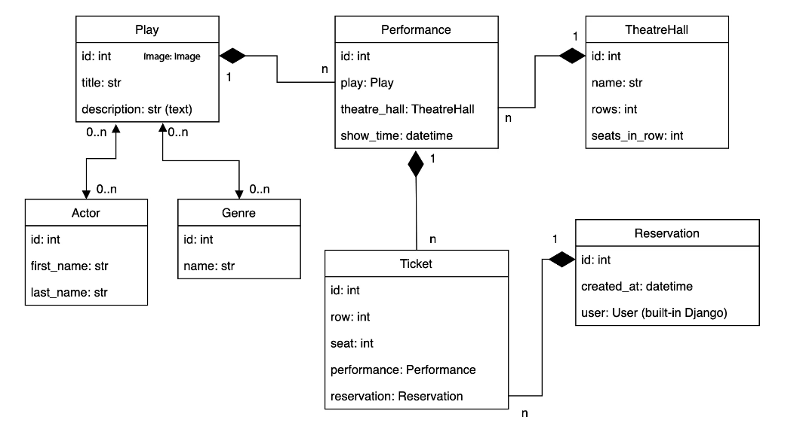

# Theatre API Service

API service for theatre management written on DRF

## Installing using GitHub

Install PostgresSQL and create db

```shell
git clone https://github.com/tiron-vadym/theatre-api-service
cd theatre_API
python -m venv venv
source venv/Scripts/activate
pip install -r requirements.txt
set DB_HOST=<your db hostname>
set DB_NAME=<your db name>
set DB_USER=<your db username>
set DB_PASSWORD=<your db user password>
set SECRET_KEY=<your secret key>
python manage.py migrate
python manage.py runserver
```

## Run with docker

Docker should be installed

```shell
docker-compose build
docker-compose up
```

## Getting access

* create user via /api/user/register
* get access token via /api/user/token

## Features

* JWT authenticated
* Admin panel /admin/
* Documentation is located at /api/doc/swagger/ or /api/doc/redoc/
* Used @property in Play model
* Used nested serializers, different serializer relations, field source and SerializerMethodField
* Privacy for every reservation
* Implemented validation for tickets
* Filtering feature for plays is located at /api/theatre/plays/?title=
* Taken seats for performances /api/theatre/performances/pk/
* Tickets available feature for performances is located at /api/theatre/performances/
* Reservation history with pagination /api/theatre/reservations/
* Custom permissions
* Implemented logic for uploading images for plays
* Used email instead of username for users /api/user/register/

## DB schema



